# Excel-Data-Analytics
### A project demonstrating my Excel skills.
## Introduction

Utilizing a 2023 dataset, the Salary Dashboard was developed to empower data analytics job seekers with valuable insights. Encouraging users to explore salary trends, the dashboard includes preferred job portals, and geographic locations and roles in the field of data analytics, helping to make informed career decisions.

- 🛠️ **Excel Features:** Bar charts feature (formatted salary values) optimized for clarity.
- 🎨 **Design Choice:** Horizontal bar charts were used for visual comparison of median salaries instead of column charts.
  

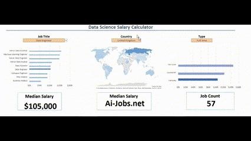

### Data Jobs Dataset

The dataset used for this project contains real-world data science job information as of 2023. In using the dataset, it enhanced my Excel skills demonstrating visuals needed in working in the field of data analytics. 

The dataset includes detailed information on job titles, salaries, required skills, job locations, and job search websites.

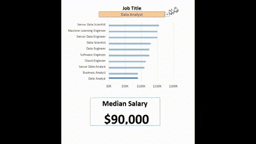  

In the above demonstration, and the code below, to highligh the role selected, I utilized the same query. Simply changing the absolute reference of, in this build, cell D2 from not equal, (<>), to equal ( = ), highlights the selected role. 

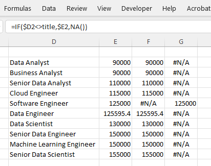

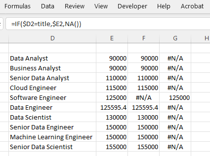

- **👨‍💼 Job Title**
- **💰 Salaries**
- **📍 Locations**
  
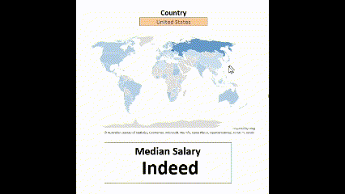

To make the map more than just a tool for highlighting countries with the most potential, users can hover over a region to quickly access role-based salary comparisons.

The formula =SORT(FILTER(A2:B112, ISNUMBER(B2:B112)), 2, 1) achieves filtering, FILTER(A2:B112, ISNUMBER(B2:B112)) the data in range A2:B112 to include only rows where the values in the adjacent column, column-B are numbers. 

Using the ISNUMBER function, the "sort" filters data based on the second column (column B), in ascending order. The 2 specifies the column to sort by, and the 1 specifies ascending order.

### ⏰ Job Schedule Type

- 🔍 **Multi-Criteria Filtering:** To filter to Job Type, a drop-down further filters the role excluding blanks.
- 🎯 **Tailored Insights:** This provides specific and detailed role information for job titles, regions, and schedule.

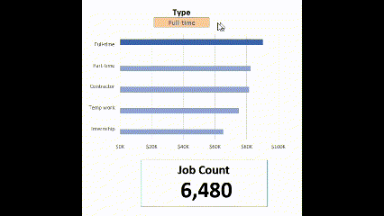  

As above, referencing the code below, to highligh the role selected, I utilized the same query. Changing the absolute reference of, in this build, cell D2 from not equal, (<>), to equal ( = ), highlights the selected role. 

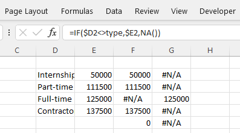

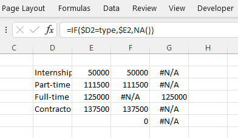

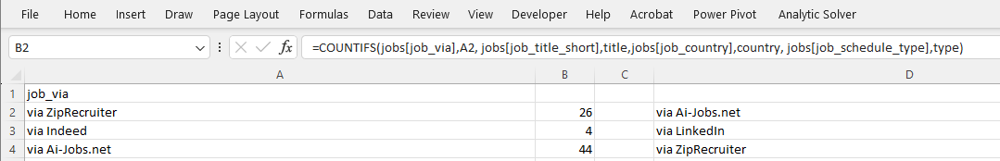

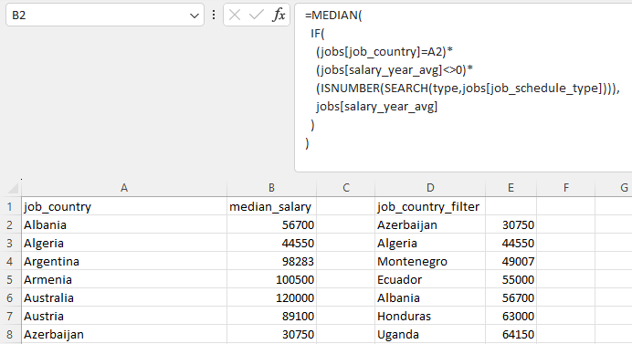

### 📉 Charts

#### 📊 Data Science Job Salaries - Bar Chart

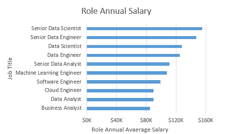

- 🛠️ **Excel Features:** I utilized bar charts where in a horizontal layout, is easier to read. Essentially, it is optimized layout for clarity.
- 🎨 **Design Choice:** The horizontal bar chart, as a role is selected, the "role" is highlighted for visual comparison of median salaries against other salaries.
- 📉 **Data Organization:** The chart, sorted in a descending format also aides in readability.
- 💡 **Insights Gained:** When viewed with the selection of the "country" and "type" provides a comparrison of roles.

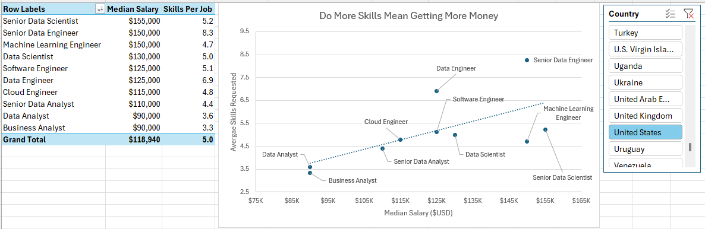

## Conclusion

The effort behind the dashboard was created to provided to highlight my skills, and provide insights into the salary, the count of jobs, and trends across various data-related job titles. 

Built using real-world data, it empowers users to make informed career decisions by exploring how factors such as location and job type through the interactive features offering a deeper understanding of the data analytics job market. The purpose of the effort is to assist data analytics professionals in planning their career paths.
