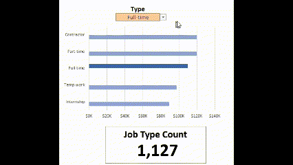
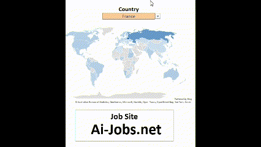

# Excel-Data-Analytics
### A project demonstrating my Excel skills.
## Introduction

Utilizing a 2023 dataset, the Salary Dashboard was developed to empower data analytics job seekers with valuable insights. Encouraging users to explore salary trends, the dashboard includes preferred job portals, and geographic locations and roles in the field of data analytics, helping to make informed career decisions.

- 🛠️ **Excel Features:** Bar charts feature (formatted salary values) optimized for clarity.
- 🎨 **Design Choice:** Horizontal bar charts were used for visual comparison of median salaries instead of column charts.
  

### Data-Jobs Dataset

The dataset for this project consists of real-world data science job information from 2023, offering comprehensive insights into job titles, salaries, required skills, locations, and job search platforms.

From a professional perspective, analyzing this dataset enhanced my expertise in Excel, particularly in generating queries to derive statistical insights into data analytics roles and developing impactful visualizations.

- 🛠️ **Functionality in Excel:** Other platforms for analysis are also available, particularly Python, which is widely used. Meanwhile, Excel continues to evolve, offering improved performance and capabilities.

  

In the above demonstration, and the code below, to highligh the role selected, I utilized the same query. Simply changing the absolute reference of, in this example, cell D2 from not equal, (<>), to equal ( = ), highlights the selected role. 

The code below highlights the columns used to calculate the median values, utilizing the MEDIAN IF function as an array formula. This function is particularly effective for analyzing large datasets—in this case, nearly 33,000 rows of data. To execute the formula correctly, it must be entered as an array formula by pressing Ctrl+Shift+Enter instead of simply Enter.

- **👨‍💼 Job Title**
- **💰 Salaries**
- **📍 Locations**
  

To make the map more than just a tool for highlighting countries with the most potential, users can hover over a region to quickly access role-based salary comparisons.

The formula =SORT(FILTER(A2:B112, ISNUMBER(B2:B112)), 2, 1) achieves filtering, FILTER(A2:B112, ISNUMBER(B2:B112)) the data in range A2:B112 to include only rows where the values in the adjacent column, column-B are numbers. 

Using the ISNUMBER function, the "sort" filters data based on the second column (column B), in ascending order. The 2 specifies the column to sort by, and the 1 specifies ascending order.

### ⏰ Job Schedule Type

- 🔍 **Multi-Criteria Filtering:** To filter Job Type, a drop-down allows customization of the role, without blanks.
- 🎯 **Tailored Insights:** Combining the filtering of the postion type and detailed role information for job titles, regions, and schedule.

  

Referring to the demonstration above to the code below, to highligh the role selected, I utilized the same query. Changing the absolute reference of cell D2 from not equal, (<>), to equal ( = ), to highlight the selected role. 

## 🔭 **Job-site, Job-site; Which Job Site**

   

Let’s be honest—finding a new job is a job in itself. As soon as you secure a new role, it’s essential to update your LinkedIn profile and proactively start exploring future opportunities. Interviewing is a critical skill in any position, as no job is guaranteed. Unforeseen circumstances can lead to the elimination of your role. This dropdown menu, derived from the dataset, highlights the platforms where data analytics positions are most frequently listed, providing valuable resources in such situations.
   

   
The formula counts the rows in the jobs table where all the following conditions are true:\
✅The job_via column matches the value in cell A2, this sheet.\
✅The job_title_short column matches the value in title, from a different sheet.\
✅The job_country column matches the value in country, from a different sheet.\
💲The job_schedule_type column matches the value in type.

###

### 📉 Charts

### 📊 Data Science Job Salaries - Bar Chart

- 🛠️ **Excel Features:** I utilized bar charts where in a horizontal layout, is easier to read. Essentially, it is optimized layout for clarity.
- 🎨 **Design Choice:** The horizontal bar chart, as a role is selected, the "role" is highlighted for visual comparison of median salaries against other salaries.
- 📉 **Data Organization:** The chart, sorted in a descending format also aides in readability.
- 💡 **Insights Gained:** When viewed with the selection of the "country" and "type" provides a comparrison of roles.

## Conclusion

The effort behind the dashboard was created to provided to highlight my skills, and provide insights into the salary, the count of jobs, and trends across various data-related job titles. 

Built using real-world data, it empowers users to make informed career decisions by exploring how factors such as location and job type through the interactive features offering a deeper understanding of the data analytics job market. The purpose of the effort is to assist data analytics professionals in planning their career paths.
